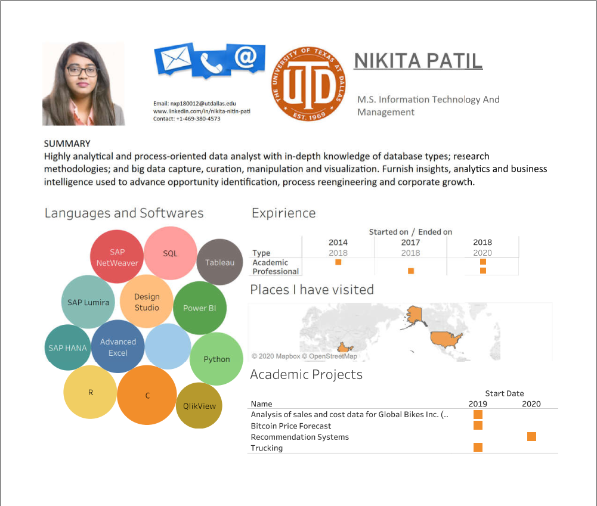

## Portfolio

---
### Project 1

Truck Transport Analysis
 
<a href="Big Data (2).pptx">View My Project Link</a> 

### Project 2

Builiding a popularity based recommendation system.
 
<a href="https://github.com/nikitanitinpatil/recommendation-system.git">View My Project Link</a> 

### Project 3

Used titanic dataset that contained information about 891 people on board for predicting the survival rates of passengers on board.
 
<a href="titanic ML.ipynb">View My Project Link</a> 

### Generating a resume in Python

Created a resume using matplotlib library in Python.
 
<a href="resume.ipynb">View My Project Link</a> 

### Resume

Created an interactive resume using Tableau.
 

---
<!-- Remove above link if you don't want to attibute -->
